# 🚀 End-to-End GitOps CI/CD Pipeline with EKS, Jenkins & Argo CD

This project demonstrates a complete GitOps workflow for a Java-based application. It automates everything from code commit to deployment on Amazon EKS (Elastic Kubernetes Service) using a multi-tool pipeline.

---

## 🛠️ Tech Stack

Cloud: AWS (EC2, EKS, VPC, IAM)

CI/CD: Jenkins (Master-Agent Architecture)

GitOps: Argo CD

Containerization: Docker

Orchestration: Kubernetes (EKS)

Build Tool: Maven

Infrastructure Tool: eksctl

---

## 🏗️ System Architecture & Workflow

### 1\. Continuous Integration (CI) - The Build Phase
  * **Source Control:** Jenkins triggers on every `git push` to the application repository.
  * **Maven Build:** Compiles the Java code and generates artifacts.
  * **Dockerization:** Builds a Docker image and tags it with the Jenkins Build Number (e.g., `v1.0.0-7`).
  * **Image Registry:** Pushes the newly built Docker image to **Docker Hub**.
  * **Remote Trigger:** Upon success, it uses a **Secure API Token** to trigger the downstream CD Job.

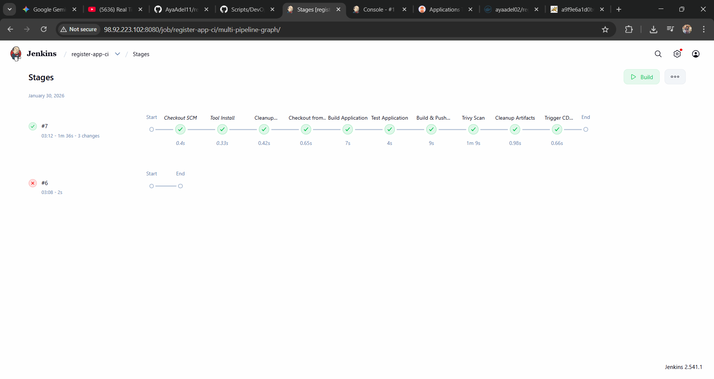


### 2\. Continuous Deployment (CD) - The Manifest Update
  * **Manifest Manipulation:** The CD job clones the GitOps repo and uses `sed` to update the `imageTag` in `deployment.yaml`.
  * **Automated Commit:** Pushes the updated manifest back to GitHub using Jenkins credentials.

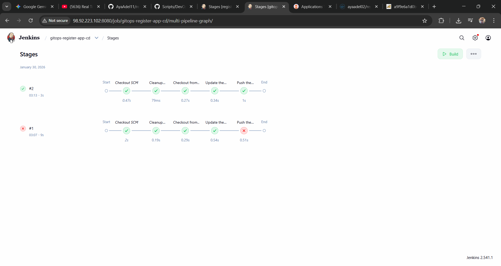


### 3\. GitOps - The Sync Phase
  * **Declarative Setup:** Argo CD monitors the GitOps repository.
  * **Automated Sync:** Once it detects the new image tag in GitHub, it pulls the latest image from Docker Hub and updates the EKS deployment via a **Rolling Update** strategy.

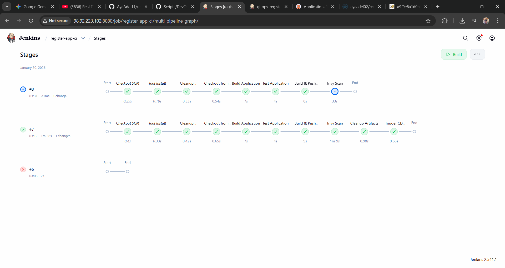
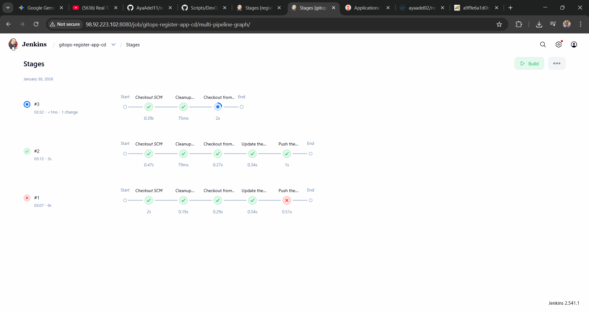

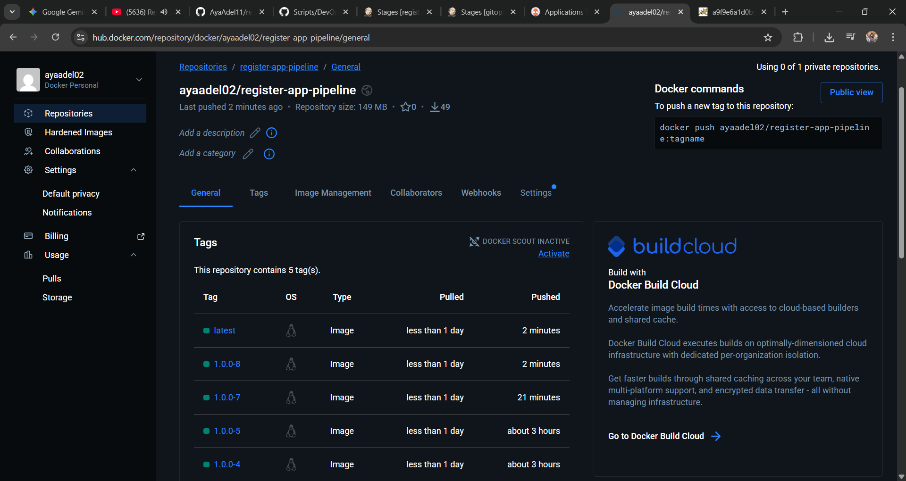
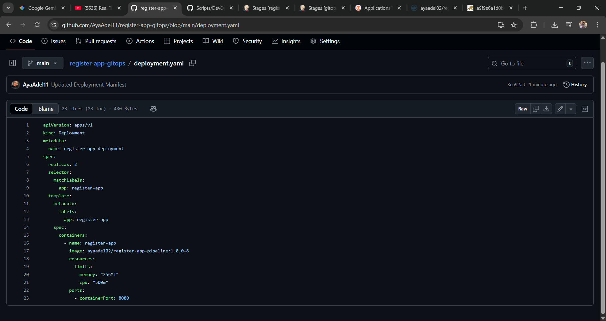

-----

## 🚀 Deployment Guide

### Step 1: Provisioning Infrastructure (IaC)
The EKS cluster was provisioned in us-east-1 with a managed node group for high availability:

```bash
eksctl create cluster --name virtualtechbox-cluster \
--region us-east-1 \
--node-type t3.small \
--nodes 2 \
--managed
```
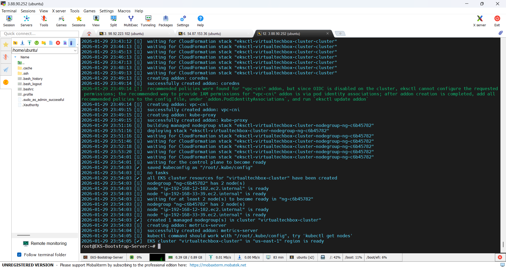

Step 2: Jenkins Pipeline & API Security
CI/CD Linking: Jobs are linked via Authentication Tokens to ensure secure cross-job communication.

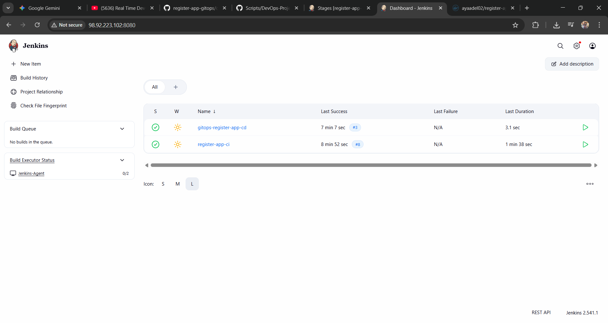

Image Management: Verified successful image pushes to Docker Hub with unique build tags.

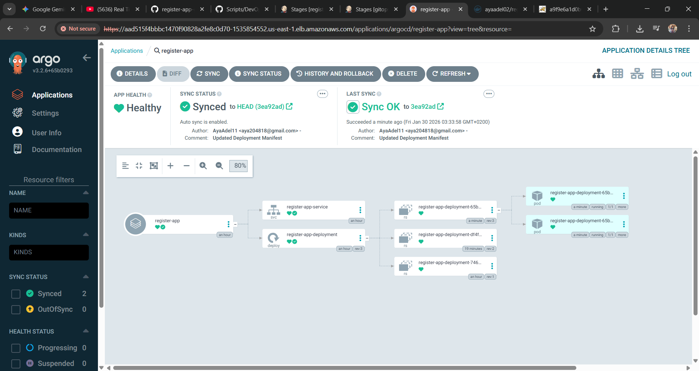
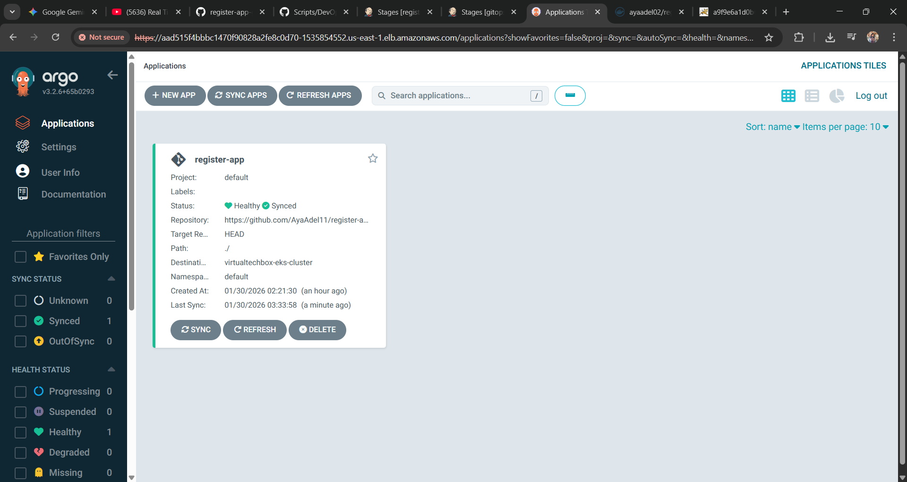

---

## 🖼️ Application Showcase

Here's a preview of the deployed `register-app` microservice running successfully on Amazon EKS, accessible via its AWS Load Balancer URL.

**Screenshot of the Live Application:**

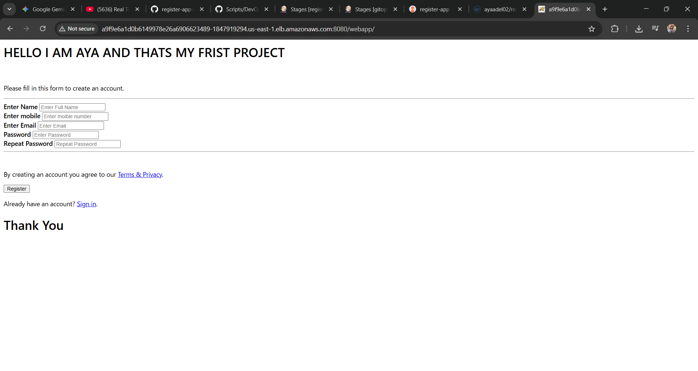

---

## 📋 Key Pipeline Features

Automated Image Tagging: Uses sed to update the deployment manifest dynamically in every build.

Security: Implements Jenkins API tokens for secure remote job triggering.

Managed Nodes: Utilizes AWS Managed Node Groups for better stability and easier maintenance.

Self-Healing: Argo CD ensures the cluster state always matches the Git repository.

---

## 🧹 Cleanup

To avoid unnecessary AWS costs, the following steps were taken to decommission the environment:

Deleted EKS cluster: eksctl delete cluster --name virtualtechbox-cluster.

Terminated EC2 Jenkins instances.

Released Elastic IPs and deleted unused EBS volumes.

---

👩‍💻 Author
Aya Adel DevOps Engineer in Training
